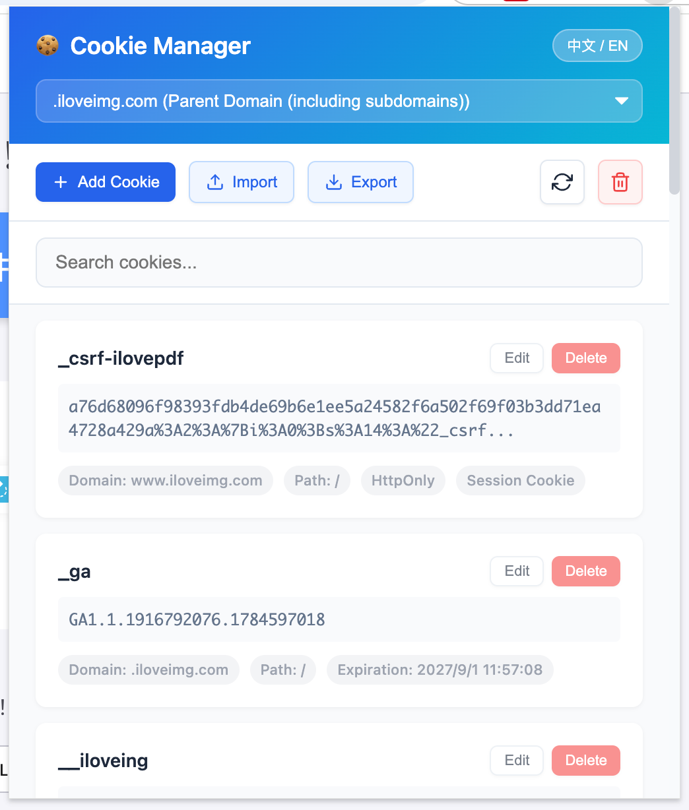

简体中文 | [English](/README.md)

# 🍪 Cookie管理工具（Cookie Manager）

<div align="center">
  
  <br>
  <br>
</div>

---

一款轻量的 Chrome/Edge 浏览器扩展，用于查看和管理网站 Cookie，支持新增、编辑、删除、搜索、JSON 导入导出及域名筛选。

## 功能特点

- 🍪 **Cookie管理**：查看、添加、编辑和删除任何网站的Cookie
- 📥 **JSON导入**：支持选择 `.json` 文件或粘贴JSON内容批量导入
- 📤 **JSON导出**：将当前所选域名的Cookie导出为可再次导入的JSON文件
- 🌍 **国际化支持**：支持中英文切换，并根据浏览器地区/语言自动设置默认语言
- 🔍 **搜索功能**：通过名称快速查找Cookie
- 🌐 **域名支持**：跨不同域名和子域名管理Cookie
- ⚡ **批量操作**：一键清空所选域名的全部Cookie
- 🎨 **现代UI**：紧凑直观的弹出界面，弹框标题与操作区固定显示
- 🔒 **高级选项**：支持Secure、HttpOnly和SameSite属性
- 📅 **过期控制**：为Cookie设置自定义过期时间
- 🔄 **实时更新**：即时刷新Cookie列表

## 安装方法

### Chrome/Edge浏览器
1. 下载或克隆此仓库
2. 打开Chrome/Edge浏览器，访问 `chrome://extensions/` 或 `edge://extensions/`
3. 在右上角启用"开发者模式"
4. 点击"加载已解压的扩展程序"，选择项目根目录或构建生成的 `dist/cookie-manager/` 目录
5. 扩展图标将出现在浏览器工具栏中

如需先生成分发包，请参考下方[构建](#构建)说明。

## 使用方法

1. **打开扩展**：点击浏览器工具栏中的Cookie图标
2. **查看Cookie**：弹出窗口将显示当前网站的所有Cookie
3. **切换语言**：点击顶部的"中文 / EN"按钮切换语言
4. **搜索Cookie**：使用搜索框按名称过滤Cookie
5. **添加新Cookie**：点击"新增Cookie"按钮并填写详细信息
6. **导入Cookie**：点击"批量导入"，选择JSON文件或粘贴JSON内容后确认
7. **导出Cookie**：点击"导出"，下载所选域名下的Cookie
8. **编辑Cookie**：点击Cookie旁边的编辑按钮
9. **删除Cookie**：点击Cookie旁边的删除按钮
10. **清空所有**：点击垃圾桶图标，删除所选域名下的全部Cookie
11. **刷新**：点击刷新图标重新加载Cookie列表

## JSON格式

导入内容必须是Cookie对象数组，其中 `name` 和 `value` 为必填字段，其他字段可选：

```json
[
  {
    "name": "session_id",
    "value": "example-value",
    "domain": ".example.com",
    "path": "/",
    "secure": true,
    "httpOnly": true,
    "sameSite": "lax",
    "session": false,
    "expirationDate": 1798761600
  }
]
```

导出文件使用相同格式，可直接重新导入。

## Cookie属性

添加或编辑Cookie时，可以配置以下属性：

- **名称**：Cookie标识符（必填）
- **值**：Cookie数据（必填）
- **域名**：Cookie域名范围
- **路径**：Cookie有效的URL路径
- **过期时间**：过期日期和时间
- **Secure**：仅通过HTTPS传输
- **HttpOnly**：防止客户端访问
- **SameSite**：CSRF保护级别（无/Lax/严格）
- **会话Cookie**：创建仅会话的Cookie

## 权限要求

扩展需要以下权限：

- `cookies`：访问和修改浏览器Cookie
- `activeTab`：访问当前标签页信息
- `*://*/*` 主机权限：访问弹窗中所选网站的Cookie

## 开发信息

### 文件结构
```
cookie-manager-extension/
├── manifest.json          # 扩展清单文件
├── background.js          # 后台服务工作线程
├── popup.html            # 弹出界面
├── popup.css             # 弹出样式
├── popup.js              # 弹出功能
├── locales/
│   ├── en.js             # 英文语言包
│   └── zh.js             # 中文语言包
├── package.json          # npm 脚本与开发依赖
├── scripts/
│   └── build.js          # Node.js 构建脚本（打包扩展到 dist/）
└── public/
    └── icon.png          # 透明背景扩展图标
```

### 构建
需要 Node.js 22 或更高版本。

```bash
npm ci
npm run build
```

构建产物：未打包扩展目录 `dist/cookie-manager/`，以及可分发的压缩包 `dist/cookie-manager-v<version>.zip`。

### 使用技术
- HTML5、CSS3、JavaScript (ES6+)
- Chrome扩展清单V3
- 浏览器Cookie API

## 浏览器支持

- ✅ Chrome（清单V3）
- ✅ Edge（清单V3）
- ⚠️ 其他Chromium内核浏览器可能可用，但尚未专门测试

## 隐私与安全

- 所有Cookie操作都在您的浏览器本地执行
- 不会向外部服务器发送任何数据
- 导入和导出的JSON文件均在本地处理
- 遵循浏览器扩展安全最佳实践

## 贡献指南

1. Fork此仓库
2. 创建功能分支（`git checkout -b feature/amazing-feature`）
3. 提交更改（`git commit -m '添加一些 amazing 功能'`）
4. 推送到分支（`git push origin feature/amazing-feature`）
5. 打开拉取请求

## 许可证

此项目采用MIT许可证 - 详见[LICENSE](LICENSE)文件。

## 支持

如果您遇到任何问题或有疑问，请在GitHub上打开问题。

---

**注意**：此扩展专为开发人员和高级用户设计，用于测试和开发目的管理Cookie。在生产网站上修改Cookie时请务必谨慎。
